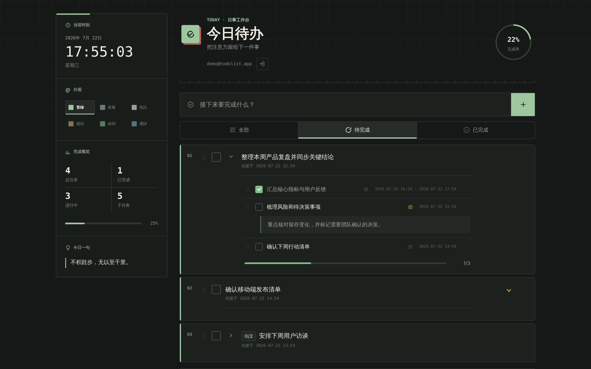
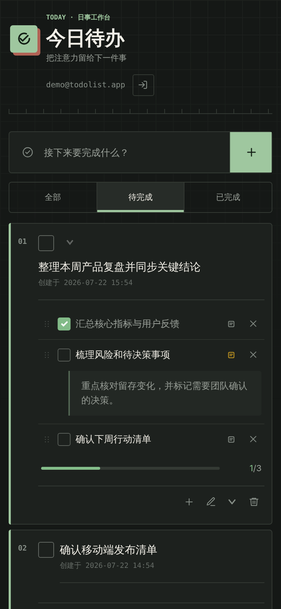

# Todolist

A polished, responsive task manager that keeps personal work organized and synchronized across devices.

[中文介绍](README_zh.md) | [Live Demo](https://gh4169.github.io/todolist/)

## Introduction

Todolist helps you organize everyday work with tasks and subtasks, track progress, add notes, reorder priorities, and focus on what is still in progress. After signing in, your private task list stays synchronized across devices, while flexible filters, statistics, and visual themes make the workspace easy to adapt to your routine.

The application is built with HTML, responsive CSS, and modular Vanilla JavaScript. Supabase provides account authentication, cloud data storage, access control, and realtime synchronization, while GitHub Pages hosts the static frontend.

## Screenshots

### Desktop

### Mobile

  

**Key Features:**

**For users:**

- Create parent tasks and subtasks, edit titles and descriptions inline, mark work as complete, collapse task groups, and clear completed items in bulk.
- Reorder tasks and subtasks with drag and drop so the most important work stays at the top.
- Start in the active view, switch between all, active, and completed tasks, and restore the last filter selected by each account on the current browser.
- Review completion rates, task statistics, subtask progress, and timestamps at a glance.
- Register and sign in with email, recover a forgotten password, and access a private task list that stays synchronized across devices.
- Choose from six persistent themes and use the responsive interface comfortably on desktop and mobile screens.

**Technical highlights:**

- Uses semantic HTML, responsive CSS, and modular Vanilla JavaScript without a frontend framework or build step.
- Uses Supabase Auth and PostgreSQL for persistent accounts and task data, protected by Row Level Security and user-scoped relationships.
- Propagates task changes between active clients through private Supabase Realtime Broadcast channels.
- Persists task content, status, descriptions, interface state, and ordering in the cloud, with the static frontend deployed on GitHub Pages.

> 💡 Tip: Visit the [Live Demo](https://gh4169.github.io/todolist/) to explore the complete experience.
