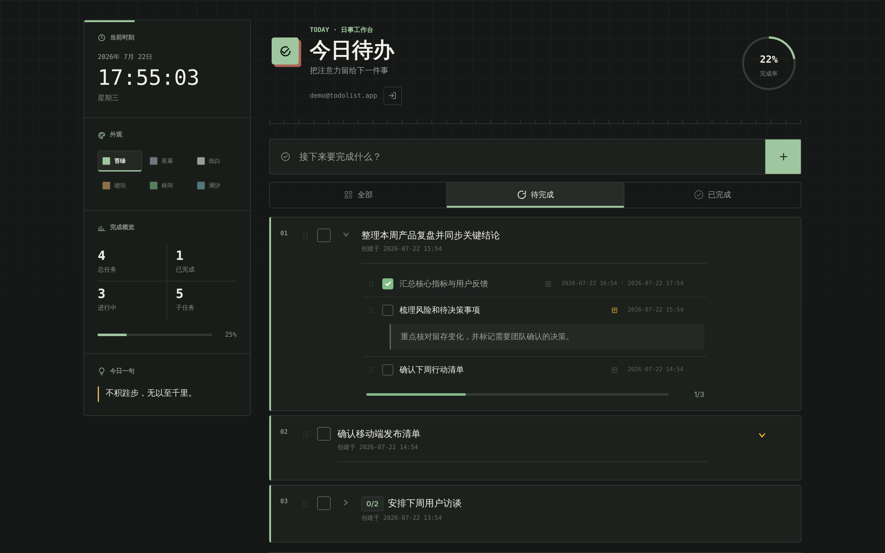
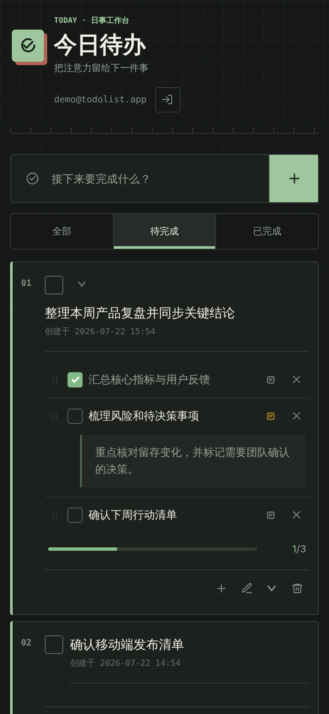

# TodoList

一款精致且响应式的任务管理工具，让个人事务井然有序，并可在多设备间保持同步。

[English Version](README.md) | [在线体验](https://gh4169.github.io/todolist/)

## 项目介绍

TodoList 帮助你整理日常工作：使用自定义分组收纳父任务、创建子任务、记录详细说明、调整优先顺序并跟踪完成进度。登录后，你可以在不同设备上访问实时同步的私人任务列表，并通过可折叠侧栏、显示设置和多套主题调整工作空间。

在技术实现上，应用使用 HTML、响应式 CSS 和模块化 Vanilla JS 构建。Supabase 负责账号认证、云端数据存储、访问控制与实时同步，静态前端则通过 GitHub Pages 托管。

## 界面预览

### 电脑端

### 手机端

  

**核心功能：**

**用户功能：**

- 创建父任务和子任务，直接编辑标题与描述，标记完成状态，折叠任务组，并可批量清除已完成任务。
- 在进行中的父任务内优先显示未完成子任务，并将已完成子任务收纳到可记忆的折叠区。
- 将父任务或子任务独立安排到今天或任意未来日期，通过“后续待办”按日期集中查看未来计划，并可把往日未完成事项重新安排到今天或未来。
- 为父任务和子任务设置按日期保存的完成目标；卡片聚焦当前或最近目标，历史目标可在编辑面板中查看、修改和删除。
- 按日期评价父任务和子任务的每日完成情况；已安排任务到次日仍未评价时自动记为“未推进”，并保留当天目标快照供后续复盘。
- 在今日待办中记录按日期保存的“今日复盘”，整理计划外事务、探索、阻塞依赖和次日调整，并可从历史列表补充或修改往日记录；详见 [`docs/daily-review-journal-design.md`](docs/daily-review-journal-design.md)。
- 创建、排序、行内重命名和删除自定义分组，将父任务连同子任务拖动或批量移动到其他分组。
- 首次使用时从“今日待办”开始，之后返回上次打开的今日、明日、后续待办或任务分组视图。
- 默认显示进行中的任务，已完成任务收纳在列表底部的可记忆折叠区。
- 桌面端侧栏可折叠为一个安静的展开按钮，移动端则使用分组抽屉。
- 快速查看完成率、任务统计、子任务进度和时间记录。
- 使用邮箱注册和登录，设置可同步的昵称与字母头像，找回忘记的密码，并在不同设备上访问私人任务列表。
- 从六套可持久化主题中自由选择，并在桌面端与移动端获得舒适的使用体验。

**技术特点：**

- 使用语义化 HTML、响应式 CSS 和模块化 Vanilla JS，无需前端框架与构建步骤。
- 使用 Supabase Auth 和 PostgreSQL 持久化账号与任务数据，并通过行级安全策略和用户级关系实现数据隔离。
- 通过私有 Supabase Realtime Broadcast 频道，在多个在线客户端之间同步任务和分组变更。
- 将任务内容、状态、描述、界面状态和排序结果持久化至云端，静态前端通过 GitHub Pages 部署。

> 💡 Tip: 如需查看完整效果，请访问[在线体验](https://gh4169.github.io/todolist/)地址。

## 数据库升级

部署本版本前，请在 Supabase SQL Editor 中完整执行最新的 [`supabase-schema.sql`](supabase-schema.sql)。脚本会增量创建分组、日期安排、完成目标、任务级完成评价和今日复盘所需的数据结构；已有任务不会被修改或删除。
